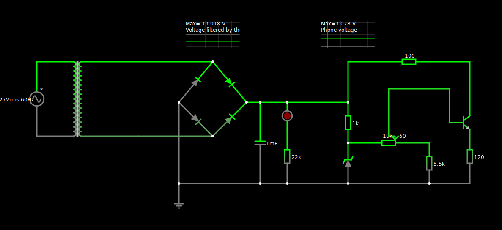
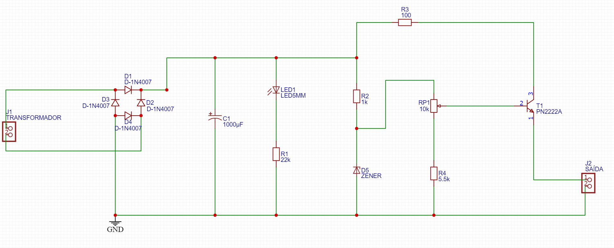
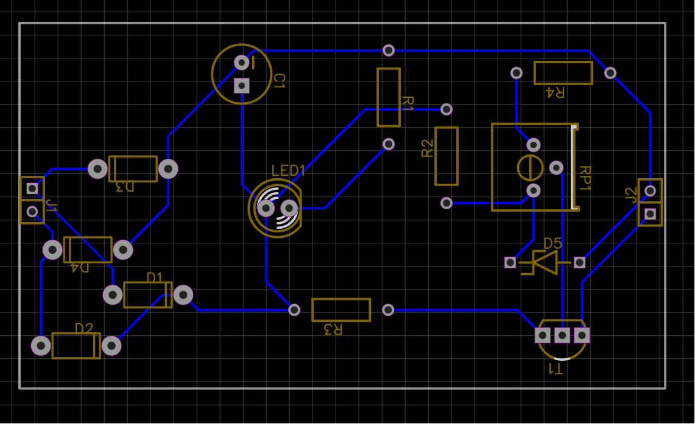

# Fonte de Tensao Ajustável

## Descricao

Fonte de tensao retificadora ajustável de 3V a 12V.

## Circuito no Falstad

## Schematic

## Board

## Tabela de Gastos

<Precisa completar>

|Quantidade|Componente|Valor|
|----------|----------|-----|
|1|Protoboard BB-01 400P|R$23,80|
|1|Capacitor 1000uF|R$|
|1|Potenciômetro 10kΩ|R$7,00|
|1|Resistor 100Ω|R$|
|1|Resistor 120Ω|R$|
|1|Resistor 1kΩ|R$|
|1|Resistor 5.5kΩ|R$|
|1|Resistor 22kΩ|R$|
|4|Diodo Retificador 1N4007|R$0,20|
|1|LED|R$0,50|
|1|Diodo Zener 13V|R$|
|1|Transistor NPN|R$|

## Alunos

* Ryan Sulino Arrua - 16900070

* Lucas Vinicius da Costa - 16885265

* Luíz Filipe Sa Vioto - 16886252

* Luis Gustavo Vieira Antoniosi - 17067476

